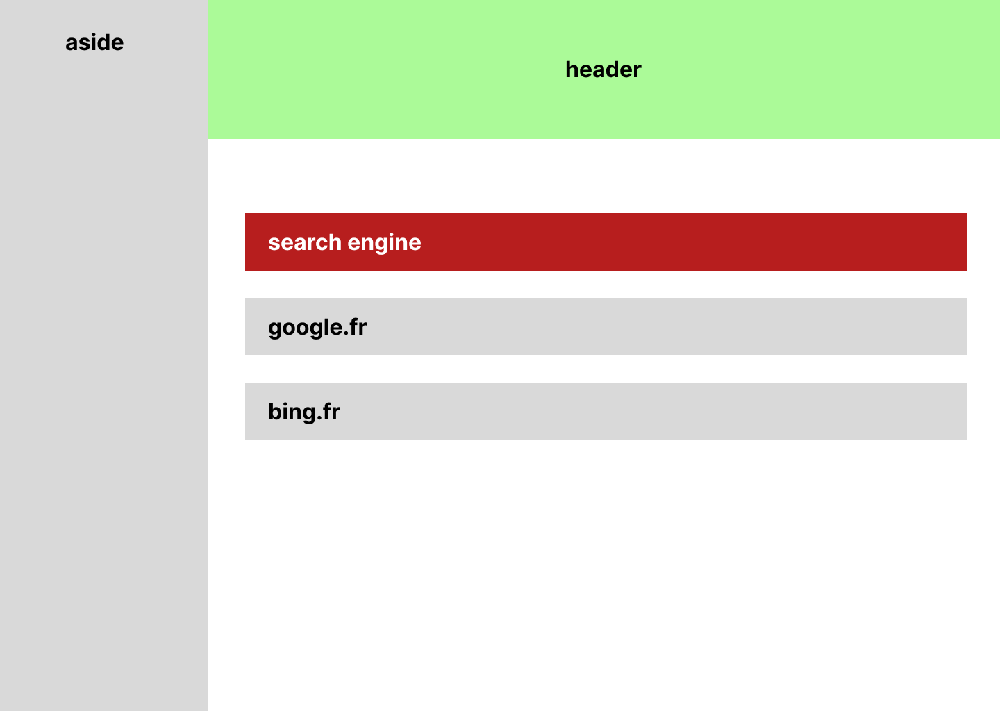

Travail à effectuer

Placer 2 blocs l'un à coté de l'autre faisant la totalité de la page
- Le bloc de gauche a un fond gris et fait 30% de la largeur
- Le bloc de droite fait le reste de la largeur

Le bloc de droite sera divisé en 2 parties:
  - un header vert fait 10% de hauteur
  - une zone de contenu fait le reste de la hauteur

La zone de contenu qui aura un fond blanc avec un espacement interne horizontal de 50px et de 100px en vertical.
Elle contiendra 3 blocs les uns sous les autres espacés de 40px
  - le premier bloc sera rouge et aura son texte ecrit en blanc
  - les suivants seront en gris et les liens seront noir, au survol souligné et rouge

